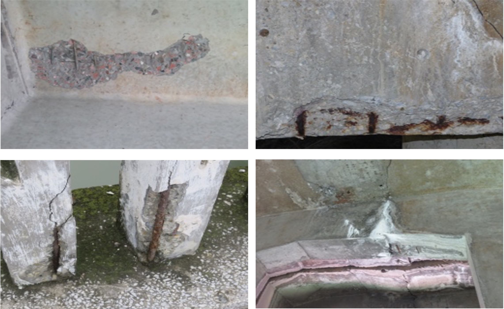

# Multi-labe_Concrete_Bridge_Damage

#### Abstract

In recent years, the advancement of convolutional neural networks (CNNs) has facilitated the emergence of deep learning-based visual inspection methods for detecting concrete bridge diseases. Nevertheless, the coexistence of various damage attributes within a single damage image hinders the comprehensive interpretation of damage images in practical bridge inspection scenarios. This poses a persistent challenge for current single classification tasks. To tackle this issue, we propose a novel algorithm that combines Graph Convolutional Neural Network (GCN) and MaxViT (Multi-Axis Vision Transformer). Our method employs MaxViT for extracting image features, followed by modeling the co-occurrence correlation of labels. Additionally, we utilize a graph convolutional neural network for extracting features that capture the correlation between labels. Finally, we fuse the image features to enable multi-label classification of damage images. To assess the effectiveness of our method, we constructed a multi-label damage classification dataset for concrete bridges. The dataset comprised 2098 samples and encompassed the four prevalent types of spall, rebar, corrosion, and crack during bridge inspections. The experimental results demonstrate that our proposed method achieves a mean Average Precision (mAP) of 99.37\% when applied to real bridge inspection images. In terms of general evaluation metrics, our method achieves an accuracy of 98.29\%, precision of 96.28\%, recall of 97.08\%, and F1-score of 96.68\%. These results indicate that our method outperforms current advanced multi-label classification networks, exhibiting higher accuracy. An interpretable analysis of the classification feature maps generated by our proposed model, using the Grad-CAM algorithm, illustrates that the model effectively directs attention to the specific regions where the damage is located. As a result, our method offers valuable engineering applications and can significantly enhance the accuracy of support provided for bridge inspection and maintenance endeavors.

#### Example

#### Data
This data was collected from commercial companies. Therefore, this dataset is limited to academic use only. Any commercial use is prohibited. You may only use this dataset for research purposes.

link：https://pan.baidu.com/s/1LVX3AoJPHjDM2sVyq9-OkQ code: x35t 

If you have any questions or idea, please let me know
email:ahaozi@mails.cqjtu.edu.cn

#### Citation
This paper is still under review......
